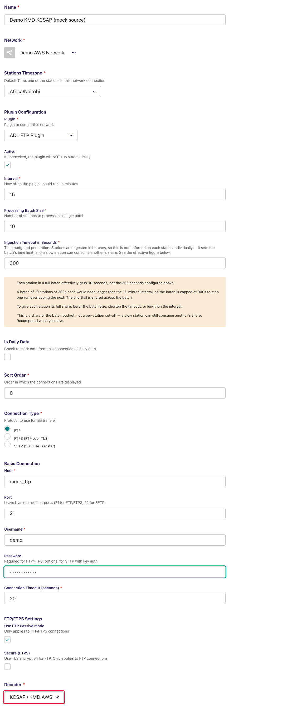
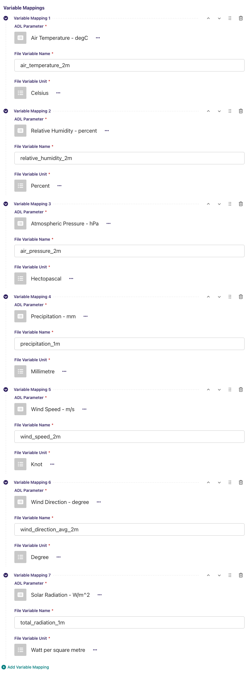
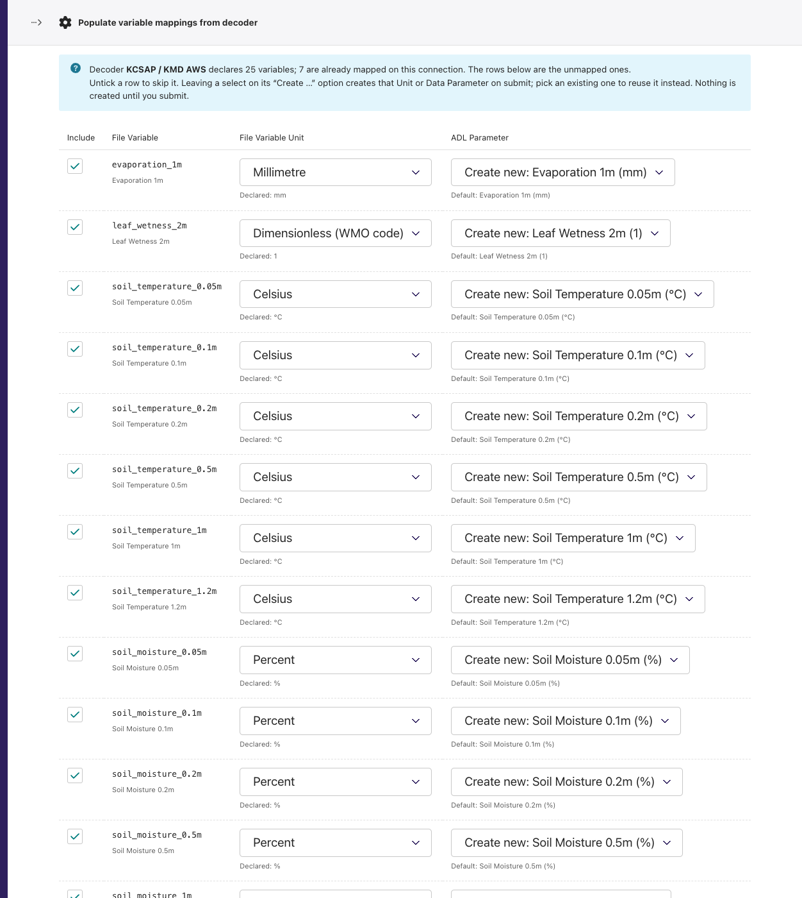
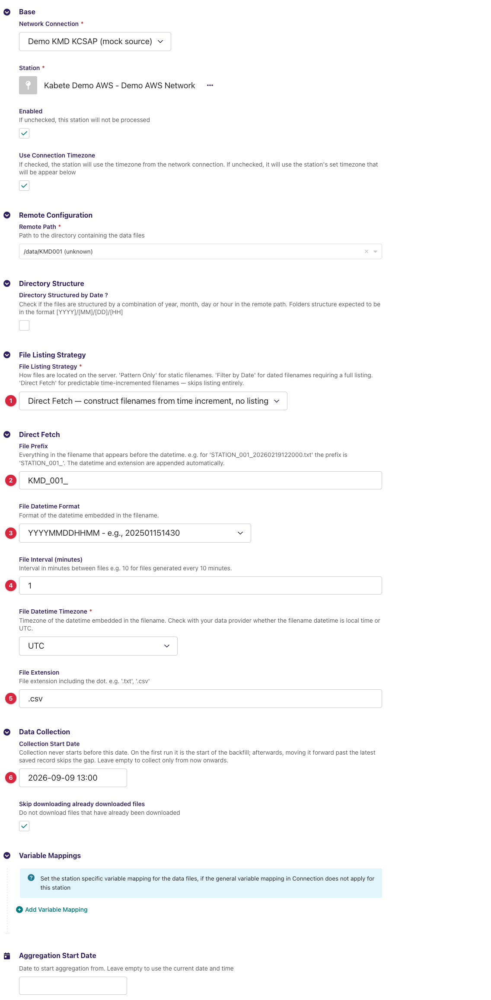
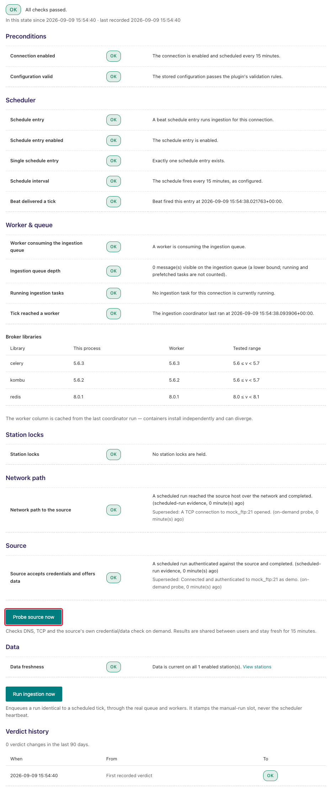
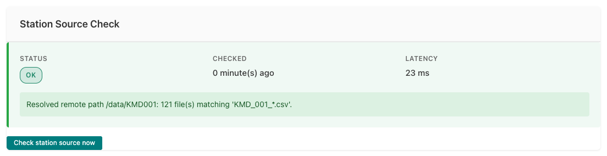
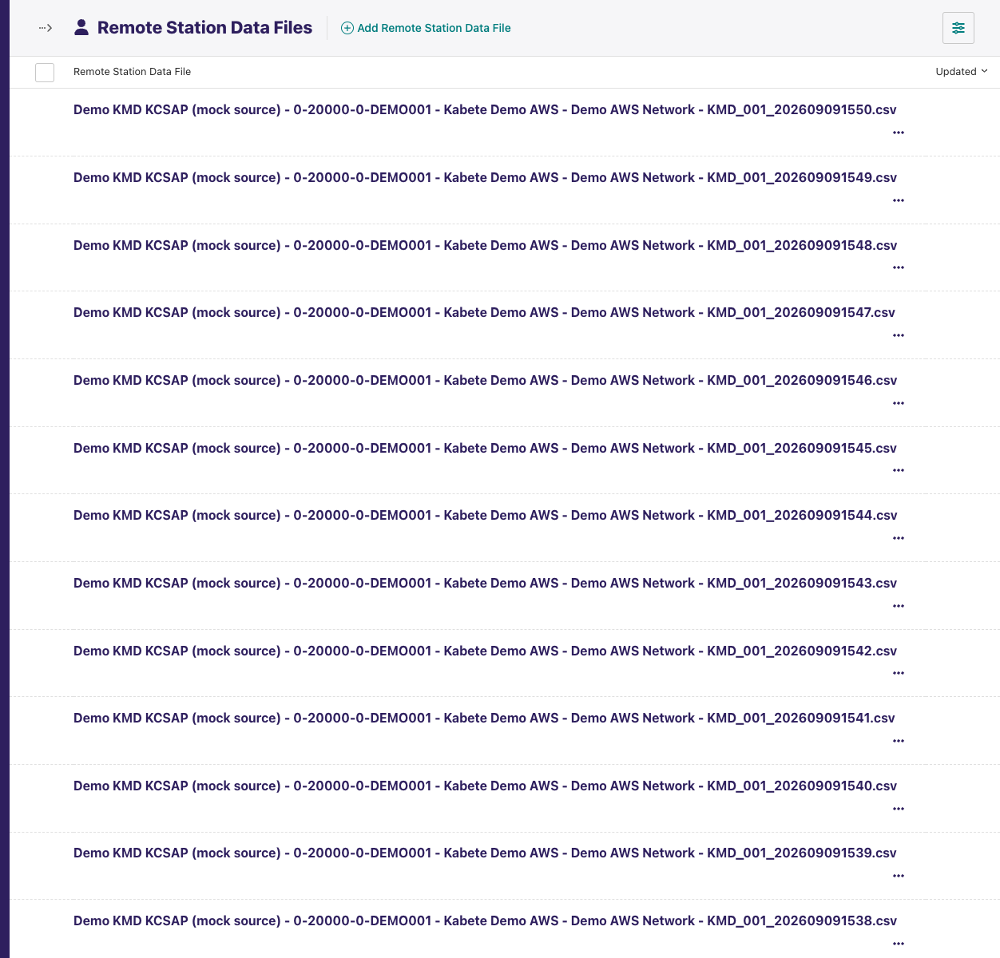

---
adl_plugin:
  name: ADL KMD KCSAP FTP Decoder
  connects_to: FTP decoder for KCSAP / KMD AWS minute files
  category: country
  country: Kenya
  country_flag: "🇰🇪"
---
# ADL KMD KCSAP FTP Decoder

Adds a **decoder** to the [ADL FTP Plugin](https://github.com/wmo-raf/adl-ftp-plugin)
for the per-minute CSV files that the **Kenya Meteorological Department (KMD)
KCSAP** automatic weather station loggers deliver over FTP: one two-line file
per station and minute, a fixed 32-field layout shared by all 157 KCSAP
stations, timestamps in UTC. With this plugin installed, an ADL FTP/SFTP
connection can select **KCSAP / KMD AWS** as its decoder and collect those
files like any other FTP source.

**Repository:** [adl-kmd-kcsap-ftp-decoder](https://github.com/wmo-raf/adl-kmd-kcsap-ftp-decoder)
**Plugin type identifier:** none — this package registers a decoder only (see below)
**Decoder identifier:** `kcsap` · **Decoder display name:** *KCSAP / KMD AWS*
**Connection model:** none of its own — uses the FTP plugin's `NetworkFTP` · **Station link model:** the FTP plugin's `FTPStationLink`

> **About the screenshots.** Every image in this guide is regenerated from
> `docs/screenshots.yml` against a seeded demo instance, so hostnames, station
> names, ids and readings in them are placeholders — not values to copy. The
> field tables are the reference for what to enter.

## Overview

This is a *decoder plugin*: it defines no connection or station link of its
own and never talks to a server. The FTP plugin does the listing and
downloading; this plugin turns each downloaded file into observation records.

```
KCSAP logger ──▶ KMD FTP server ──▶ ADL FTP Plugin (list, match, download)
                                          │
                                          ▼
                             KCSAP / KMD AWS decoder (this plugin)
                                          │
                                          ▼
                       records ──▶ variable mappings ──▶ ADL observations
```

Unlike most decoder packages this one registers **no entry in the ADL plugin
registry at all** — only the decoder. So it never appears in the *Add
connection* plugin chooser; the connection's plugin is *ADL FTP Plugin*, and
this plugin appears only as an entry in that connection's **Decoder** list.
Everything about hosts, credentials, paths, listing strategies, downloads and
the monitoring screens is documented in the
[ADL FTP Plugin guide](https://github.com/wmo-raf/adl-ftp-plugin/blob/main/docs/guide.md);
this guide covers what is specific to the KCSAP files.

Because the field layout is identical on every KCSAP station, the decoder
also **declares its variables** to the FTP plugin, which lets the connection's
variable mappings be pre-filled with one click instead of typed by hand
(see *Populate Variable Mappings from Decoder* below).

## Prerequisites

- A running ADL instance with the **ADL FTP Plugin** installed, version
  **0.10.0 or later** (this plugin imports from it and cannot load without it;
  the populate action needs 0.10.0).
- FTP/SFTP access to the KMD server the loggers deliver to — host, port,
  account, and the directory holding the files (see the FTP plugin guide's
  prerequisites for the network side).
- The KCSAP station id of each station to collect (the `<stationID>` in the
  file names, e.g. `001`), from KMD's station register (`kcsap_pars.csv`).

## Installation

Installed like any ADL plugin — see [Plugin Installation](https://adl-tool.readthedocs.io/en/latest/developer_guide/plugins/plugin_installation.html) for
all methods. Both entries are needed in `plugins.toml`, the FTP plugin first:

```toml
[[plugins]]
name = "ADL FTP Plugin"
git  = "https://github.com/wmo-raf/adl-ftp-plugin.git"
tag  = "0.13.0"

[[plugins]]
name = "ADL KMD KCSAP FTP Decoder"
git  = "https://github.com/wmo-raf/adl-kmd-kcsap-ftp-decoder.git"
tag  = "0.1.1"
```

After rebuild/restart, confirm both appear in `docker compose exec adl
list-plugins`, and that *KCSAP / KMD AWS* is offered in the Decoder list of a
new FTP connection. If the FTP plugin is missing, ADL refuses to start with
`adl_kmd_kcsap_ftp_decoder is an ADL FTP decoder plugin and requires
adl-ftp-plugin to be installed.`

## The file format this decoder reads

| Aspect | Expected |
|---|---|
| File name | `KMD_<stationID>_<YYYYMMDDHHMM>.csv`, e.g. `KMD_001_202408241414.csv` — one file per station per **minute**, the timestamp in **UTC**. |
| Lines | Exactly **two**: a short preview line (`KMD,001,202408241414`) and the record. A file with any other number of lines is skipped with a warning. |
| Record | 32 comma-separated fields. Field 3 (`YYYYMMDDHHMM`) is the observation time; fields 6 onwards are the sensor readings in the fixed order below. Any other field count skips the record. |
| Missing values | Any field made of slashes (`////`, `/////` …) is the feed's missing-value marker and is stored as missing. |
| Glued records | Occasionally two records arrive on one line joined by a literal `?KMD`; the decoder splits them back into two records. |
| Observation time | The `YYYYMMDDHHMM` field, read as **UTC** and handed to ADL as an aware datetime; ADL localises it to the station's timezone for storage. The station link's timezone setting does *not* re-interpret it. |
| Peak-gust clock | Field 29 (`HH:MM:SS`, when the minute's peak gust occurred) is deliberately **not** emitted: gust speed and direction are stored at the record's minute like every other field. |

### Variables the decoder emits

All 157 KCSAP stations share this layout, so it is fixed in the decoder. The
*File variable name* is the key you map (or let the populate action map); the
*file unit* is what the logger writes; *ADL unit* is the unit of the ADL
parameter the populate action creates when none exists yet.

| Field (1-based) | File variable name | File unit | ADL parameter created by populate | ADL unit |
|---:|---|---|---|---|
| 6 | `air_temperature_2m` | °C | Air Temperature 2m | °C |
| 7 | `relative_humidity_2m` | % | Relative Humidity 2m | % |
| 8 | `precipitation_1m` | mm | Precipitation 1m (precipitation context) | mm |
| 9 | `total_radiation_1m` | W/m² | Total Radiation 1m | W/m² |
| 10 | `air_pressure_2m` | hPa | Air Pressure 2m | hPa |
| 12 | `evaporation_1m` | mm | Evaporation 1m | mm |
| 13 | `leaf_wetness_2m` | 1 | Leaf Wetness 2m | 1 |
| 14–19 | `soil_temperature_0.05m`, `…_0.1m`, `…_0.2m`, `…_0.5m`, `…_1m`, `…_1.2m` | °C | Soil Temperature *d* m | °C |
| 20–25 | `soil_moisture_0.05m`, `…_0.1m`, `…_0.2m`, `…_0.5m`, `…_1m`, `…_1.2m` | % | Soil Moisture *d* m | % |
| 26 | `wind_speed_2m` | **knot** | Wind Speed 2m | m/s |
| 27 | `wind_gust_speed_2m` | **knot** | Wind Gust Speed 2m | m/s |
| 28 | `wind_gust_direction_2m` | degree | Wind Gust Direction 2m (circular aggregation) | degree |
| 29 | *(gust time — discarded)* | | | |
| 30 | `wind_direction_avg_2m` | degree | Wind Direction Avg 2m (circular) | degree |
| 31 | `wind_direction_min_2m` | degree | Wind Direction Min 2m (circular) | degree |
| 32 | `wind_direction_max_2m` | degree | Wind Direction Max 2m (circular) | degree |

Fields 1–5 and 11 carry no mapped variable. Wind speeds arrive in **knots**;
ADL converts them to m/s through the mapping's file unit.

## Connection configuration

Create a **Network FTP/SFTP** connection exactly as the FTP plugin guide
describes (connection type, host, port, username, password, passive mode,
timeout), then:

| Field | Value for this source |
|---|---|
| Decoder | **KCSAP / KMD AWS** |
| CSV Configuration | Leave empty — this decoder needs no configuration. |
| Variable Mappings | One row per variable to store. Use the populate action below rather than typing the 25 rows; connection-level mappings apply to every station on the connection, which suits this source since all stations share one layout. |



### Variable mappings

| Field | Description |
|---|---|
| ADL Parameter | The ADL `DataParameter` the values are stored under. |
| File Variable Name | The decoder's variable name from the table above, **exactly** (e.g. `wind_speed_2m`). |
| File Variable Unit | The file unit from the table above (`knot` for the two wind speeds). |

**Example:** ADL Parameter `Wind Speed 2m` ← File Variable Name
`wind_speed_2m`, unit `knot`; ADL converts to the parameter's m/s.



### Populate Variable Mappings from Decoder

Because this decoder declares its variables, the FTP plugin offers
**Populate Variable Mappings from Decoder** in the connection row's *…* menu
on the *Network Connections* list (FTP plugin 0.10.0 or later). It shows one
pre-filled row per variable still unmapped — existing Units and Data
Parameters are pre-selected where the names match, and missing ones are
created on submit. Re-running it later only shows what is still unmapped. The
action itself is documented in the
[FTP plugin guide](https://github.com/wmo-raf/adl-ftp-plugin/blob/main/docs/guide.md#populate-variable-mappings-from-decoder).



## Station link configuration

Create an **FTP/SFTP Station Link** per station (all fields are the FTP
plugin's; only the values matter here). Files are one per minute with the
timestamp in the name, so **Direct Fetch** — where the FTP plugin builds each
expected file name instead of listing the directory — is the natural strategy
for a directory holding thousands of files:

| Field | Value for this source |
|---|---|
| Remote Path | The directory holding the files. |
| File Listing Strategy | **Direct Fetch**. |
| Direct Fetch Prefix | `KMD_<stationID>_`, e.g. `KMD_001_`. |
| Direct Fetch Datetime Format | `YYYYMMDDHHMM`. |
| Direct Fetch Interval (minutes) | `1`. |
| Direct Fetch File Extension | `.csv`. |
| Direct Fetch Datetime Timezone | `UTC`. |
| Collection Start Date | The earliest minute to fetch. Every expected file name from this moment to now is tried on the first run, so a start date weeks back means tens of thousands of fetch attempts — set it to what you actually need. |
| Skip downloading already downloaded files | Leave **on**: a minute file never changes after it is written. |

*Filter by Date* also works when the directory is small enough to list: File
Pattern `KMD_001_*.csv`, Filename Date Format `YYYYMMDDHHMM`, Filename Date
Timezone `UTC`.



## Admin UI added by this plugin

None. This plugin adds no page, menu entry, button or form of its own; it
appears as an option in the FTP connection's *Decoder* select, and its
variable declaration is what makes the FTP plugin's *Populate Variable
Mappings from Decoder* action available on the connection. The FTP plugin's
other surfaces — *Test Decoder Configuration*, the *Direct Fetch Files*
preview, the *FTP station data files* list — work with this decoder and are
documented in the FTP plugin guide.

## Data collection behavior

One run, per enabled station link:

1. The FTP plugin works out which files to fetch — under *Direct Fetch*, one
   expected name per minute from the run's window start to now; under
   *Filter by Date*, the listed names whose embedded timestamp falls in the
   window.
2. Each file not yet held is downloaded and handed to this decoder.
3. The decoder reads the two lines, splits a glued `?KMD` pair if present,
   checks the field count, converts each mapped field to a number (slashes →
   missing), reads the UTC timestamp and yields one record per record line.
4. ADL applies the variable mappings and unit conversion (knots → m/s) and
   stores the values; rows already stored are updated, not duplicated.

- **First run:** with a *Collection Start Date*, from that minute; without
  one, from the FTP plugin's default window (see its guide).
- **Timezones:** file times are UTC and are handed to ADL as aware UTC
  datetimes. The station's timezone only decides how they are displayed.
- **Backfill:** set *Collection Start Date* before enabling the link; under
  Direct Fetch the plugin tries every minute file since then.

## Source checks / diagnostics

All monitoring for a connection using this decoder is the FTP plugin's: the
**Ingestion Diagnostic** page proves the FTP host, port and account, and the
station link's **Station Source Check** proves the resolved remote path (and,
under a listing strategy, counts the files matching the pattern). How to read
both screens is covered in
[Monitoring & Diagnostics](https://adl-tool.readthedocs.io/en/latest/user_guide/monitoring_and_diagnostics.html);
their FTP-specific messages are catalogued in the FTP plugin guide. This
plugin adds no check of its own — a file that lists and downloads fine but
does not decode shows up as a **warning in the worker log and a zero
*values saved* count**, not in the source checks.





The FTP plugin's **FTP station data files** list (Snippets → FTP station data
files) shows every file fetched for a station link with its *processed* time
and *values saved* count — the first place to look when files arrive but
nothing is stored.



### Feedback catalogue — messages involving this decoder

The decoder's own messages go to the worker log (`docker compose logs
adl_celery_worker_adl`); the FTP plugin's wrap-around messages appear in the
station's activity log and task log:

| Message (example) | Where | Meaning | What to do |
|---|---|---|---|
| `/tmp/…/KMD_001_202408241414.csv: expected 2 lines, found 3. Skipping.` | worker log (warning) | The file is not the two-line KCSAP shape; nothing is decoded from it. | Open the file: a logger writing several records per file, or a truncated transfer. Nothing to configure; report to KMD if persistent. |
| `…KMD_001_202408241414.csv: wrong field count, skipping record: KMD,001,2024…` | worker log (warning) | The record line does not split into 32 fields — a different sensor package or a corrupted line. | Compare against the layout above. A station with a different sensor set needs the decoder extended. |
| `File KMD_001_202408241414.csv decoded 0 record(s) but none of its values were saved — check the variable mappings and the ingestion window` | task log (warning) | The file was skipped by one of the two warnings above (0 records), or every mapped name missed. | See the warning that preceded it; if there is none, compare the mapping names with the table above. |
| `File KMD_001_… decoded 1 record(s) but none of its values were saved — …` | task log (warning) | The record parsed but no *File Variable Name* matched, or its time lies before *Collection Start Date*. | Run *Populate Variable Mappings from Decoder*; check the start date. |
| `direct_fetch_datetime_format is not set for station …` | task log (error) | Direct Fetch chosen without a datetime format. | Set `YYYYMMDDHHMM`. |
| `Resolved remote path /kcsap: …` | Station Source Check (OK) | The FTP plugin's station check: the directory exists. | Fine. |

## Troubleshooting

**Every file shows *values saved* 0**
: The connection has no variable mappings, or they were typed with different
  names. Use *Populate Variable Mappings from Decoder* on the connection and
  delete any hand-typed rows that duplicate a parameter.

**Only a few files per hour are fetched**
: Under *Filter by Date* the FTP listing is being truncated or is slow on a
  directory with tens of thousands of files. Switch to *Direct Fetch*.

**The first run takes hours or never finishes**
: Direct Fetch tries one file per minute from *Collection Start Date*. A start
  date a month back is 43,000 fetch attempts. Move the start date forward.

**Observation times are off by the station's UTC offset**
: They are not — the file times are UTC and are stored as such; the viewer
  shows them in the station's timezone. If a station link's *Timezone* is
  wrong it only affects display and daily aggregation, not the stored instant.

**Wind speeds look too high by a factor of two**
: The mapping's *File Variable Unit* is `m/s` instead of `knot`. Set it to
  `knot`; ADL converts.

## Compatibility

| Plugin version | Requires | Notes |
|---|---|---|
| 0.1.1 | ADL FTP Plugin >= 0.10.0 (written against 0.13.0), ADL core 0.8.x | Current release. Decoding works on any FTP plugin version; the populate action needs 0.10.0 or later. |

## Changelog

See [GitHub Releases](https://github.com/wmo-raf/adl-kmd-kcsap-ftp-decoder/releases).
